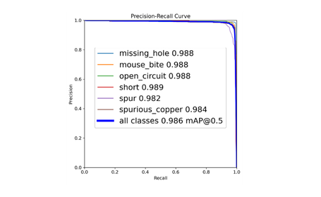
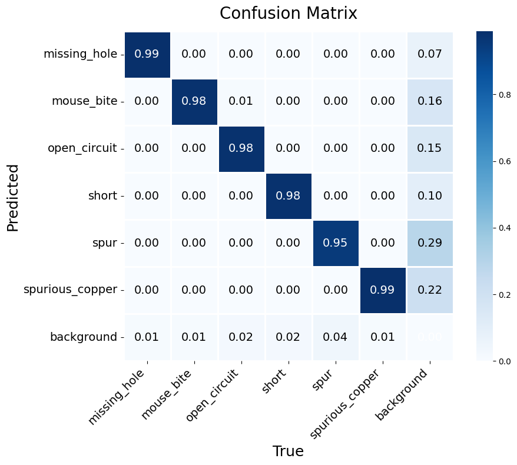
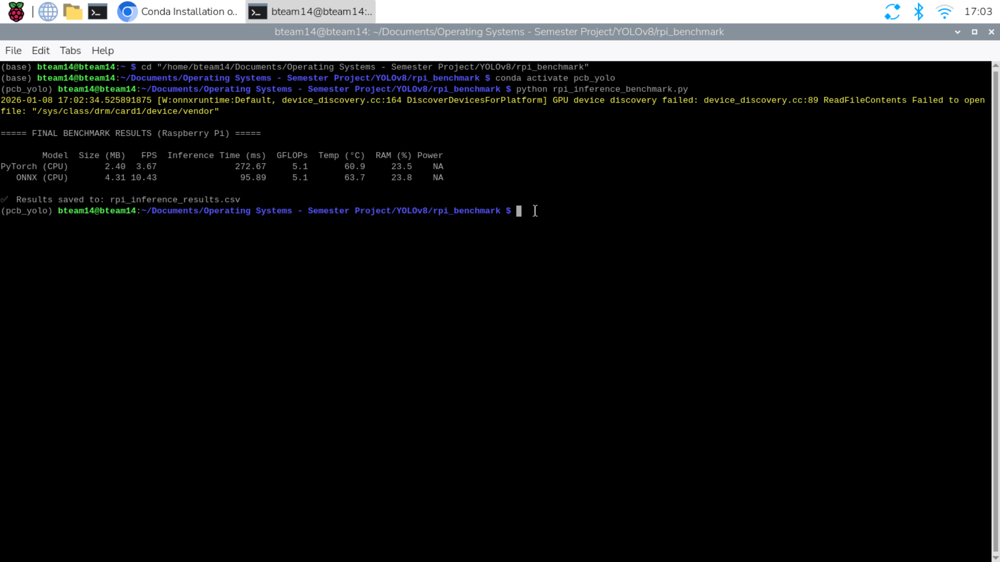

# Lightweight YOLOv8–MBNet Framework for Real-Time PCB Defect Detection

> 📄 Research Technical Report  
> 🎓 Operating Systems Project  
> 👨‍💻 Shree Santh B  

---

## 📌 Abstract

This repository presents a lightweight deep learning framework for automated PCB surface defect detection and intelligent severity grading. The proposed model redesigns the YOLOv8 backbone using depthwise separable convolutions to significantly reduce parameters while maintaining high detection accuracy.

A multi-stage pipeline integrates:

- Modified YOLOv8-MBNet detector
- Transformer-assisted severity reasoning
- Fuzzy logic-based grading system
- Edge-device deployment validation

The framework is optimized for real-time industrial inspection environments.

---

# 🏗 Proposed Architecture

## 🔹 Stage 1 – Lightweight Detection

The baseline YOLOv8 architecture was modified by:

- Replacing standard convolutions with Depthwise Separable Convolutions
- Optimizing C2f blocks
- Reducing redundant channel expansion
- Retaining SPPF for multi-scale context

### Architecture Diagram


---

# 📊 Detection Performance

| Metric | Value |
|--------|--------|
| Parameters | **1.15M** |
| GFLOPs | **5.2** |
| mAP@0.5 | **98.6%** |
| Precision | 97.4% |
| Recall | 97.0% |

✔ ~60% parameter reduction compared to baseline  
✔ Near-baseline detection accuracy  

---

# 📈 Precision–Recall Analysis



All defect classes achieve near-perfect recall with high precision, resulting in 0.986 mAP@0.5.

---

# 📊 Confusion Matrix



The confusion matrix demonstrates strong class separation with minimal misclassification between structurally similar defect categories.

---

# 🧠 Stage 2 – Severity Estimation

A lightweight transformer-based MobileViT-XS model was used for defect severity regression.

Severity score formulation:

S = α P_class + β A_norm

This enables contextual reasoning beyond bounding box detection.

---

# 🏭 Stage 3 – Fuzzy Logic Grading

Severity scores are mapped into qualitative grades:

- Grade A – Low Severity  
- Grade B – Moderate Severity  
- Grade C – Critical  

This improves industrial interpretability.

---

# 📂 Dataset

- PKU PCB Defect Dataset  
- 10,668 annotated images  
- 6 defect classes  

Classes:
- Missing Hole
- Mouse Bite
- Open Circuit
- Short Circuit
- Spur
- Spurious Copper

---

# ⚡ Edge Deployment

---

# 🍓 Raspberry Pi 5 – CPU Benchmark Results

The proposed YOLOv8-MBNet model was evaluated on Raspberry Pi 5 (CPU-only execution).

### Inference Benchmark



| Model | Size (MB) | FPS | Inference Time (ms) | GFLOPs | Temp (°C) | RAM (%) |
|-------|-----------|-----|---------------------|--------|-----------|----------|
| PyTorch (CPU) | 2.40 | 3.67 | 272.67 | 5.1 | 60.9 | 23.5 |
| ONNX (CPU) | 4.31 | 10.43 | 95.89 | 5.1 | 63.7 | 23.8 |

### Observations

- ONNX optimization improved inference speed by ~2.8×.
- Thermal behavior remained stable under continuous inference.
- Model maintains lightweight computational footprint (5.1 GFLOPs).

This validates the framework’s suitability for edge AI deployment in industrial environments.


## NVIDIA Jetson Orin Nano

| Mode | FPS |
|------|------|
| PyTorch CUDA | 27.38 |
| TensorRT FP16 | 40.22 |
| TensorRT INT8 | 41.38 |

Demonstrates hardware-aware optimization without architectural modification.

---

# 🔬 Research Contributions

- Lightweight YOLOv8 backbone redesign
- Extensive ablation study
- Transformer-assisted defect reasoning
- Fuzzy logic-based grading integration
- Cross-platform edge benchmarking

---

# 📄 Technical Report

Full research report available in:

report/YOLOV8MBNet_OS_Project_Report.pdf

# 🚀 Installation

```bash
git clone https://github.com/shreesanth-78/Surface-Defect-Detection-YOLOv8MBNet-Transfer-Learning-on-Edge-Devices.git
cd Surface-Defect-Detection-YOLOv8MBNet-Transfer-Learning-on-Edge-Devices

👨‍💻 Author
Shree Santh B
Artificial Intelligence & Data Science
Amrita School of Artificial Intelligence

📌 Future Work
Quantization-aware training

Knowledge distillation

Real-time industrial camera integration

Semi-supervised defect learning
