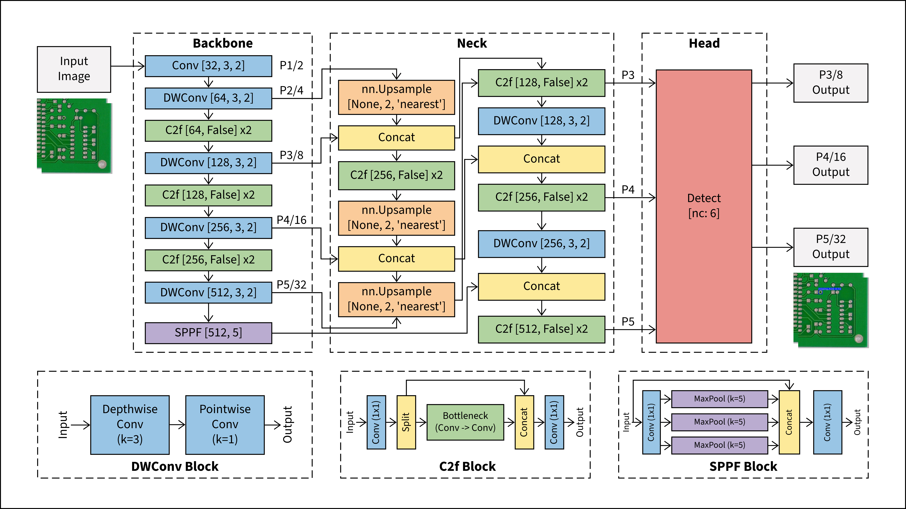
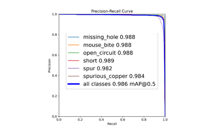
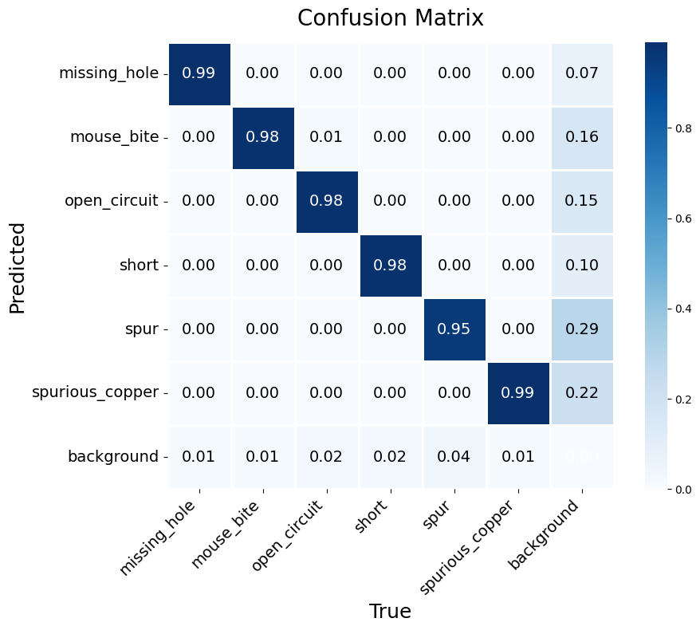
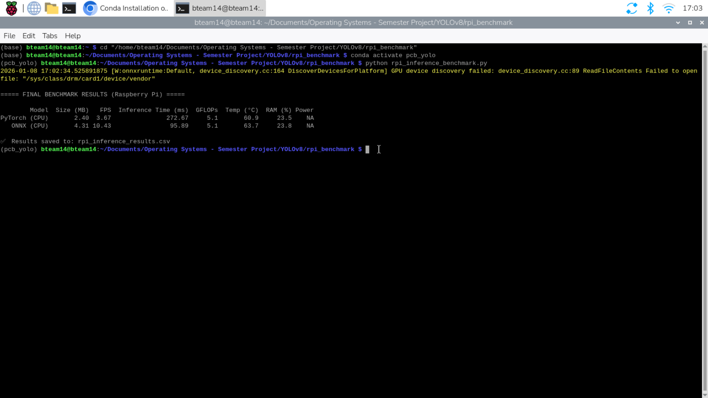
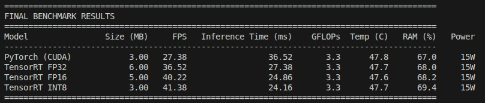

# Surface Defect Detection using YOLOv8-MBNet with Transfer Learning on Edge Devices

> 📄 Research-Oriented Technical Report  
> 🎓 Operating Systems Project  
> 👨‍💻 Shree Santh B  
> 🏫 Amrita School of Artificial Intelligence  

---

# 📌 Abstract

This repository presents a lightweight and computationally efficient deep learning framework for automated PCB surface defect detection and intelligent severity grading.

The proposed framework integrates:

- A redesigned YOLOv8-MBNet lightweight detection backbone
- Transfer learning using MobileViT-XS for severity reasoning
- Fuzzy logic-based industrial grading
- Real-time benchmarking on Raspberry Pi 5 and NVIDIA Jetson Orin Nano

The system achieves near state-of-the-art detection accuracy while significantly reducing computational complexity, making it suitable for industrial edge deployment.

---

# 🏭 Problem Statement

Industrial PCB inspection systems require:

- High detection accuracy
- Low computational cost
- Real-time edge deployment capability
- Interpretability for severity assessment

Standard YOLO architectures are computationally heavy and lack structured grading mechanisms. This project addresses these limitations.

---

# 🎯 Project Objectives

- Reduce YOLOv8 parameter count while maintaining accuracy
- Design a lightweight detection backbone (YOLOv8-MBNet)
- Integrate transfer learning for contextual defect understanding
- Implement fuzzy logic-based grading
- Benchmark performance on real edge hardware
- Conduct ablation analysis

---

# 🏗 Proposed System Architecture

The framework consists of three major stages:

1️⃣ Lightweight Detection  
2️⃣ Severity Estimation via Transfer Learning  
3️⃣ Fuzzy Logic-Based Grading  

---

## 🔹 Stage 1 – YOLOv8-MBNet Detection Backbone

Modifications to baseline YOLOv8:

- Replaced standard convolutions with Depthwise Separable Convolutions
- Optimized C2f blocks
- Reduced redundant channel expansion
- Retained SPPF for multi-scale feature aggregation

### 📐 Architecture Diagram



---

# 📊 Detection Performance

| Metric | Baseline YOLOv8n | Proposed YOLOv8-MBNet |
|--------|------------------|-----------------------|
| Parameters | 3.01M | **1.15M** |
| GFLOPs | 8.7 | **5.2** |
| mAP@0.5 | 99.2% | **98.6%** |
| Precision | 98.0% | **97.4%** |
| Recall | 99.3% | **97.0%** |

✔ ~60% parameter reduction  
✔ Maintains high detection accuracy  

---

# 📈 Precision–Recall Curve



Overall performance: **0.986 mAP@0.5**

All defect classes exhibit high precision and recall.

---

# 📊 Confusion Matrix



Strong class separability with minimal cross-class confusion.

---

# 🧠 Stage 2 – Transfer Learning (MobileViT-XS)

A lightweight transformer-assisted MobileViT-XS model was used for defect severity regression.

Why MobileViT?

- Combines CNN efficiency with Transformer global reasoning
- Lightweight and edge-compatible
- Captures structural defect patterns effectively

Training Strategy:

- Pretrained on ImageNet
- Lower layers frozen
- Higher layers fine-tuned

---

# 🧮 Stage 3 – Fuzzy Logic-Based Severity Grading

Severity score formulation:

S = α · P_class + β · A_norm

Where:

- P_class → defect confidence score  
- A_norm → normalized defect area  

Grades assigned:

- Grade A → Low Severity  
- Grade B → Moderate Severity  
- Grade C → Critical Severity  

This improves interpretability for industrial decision-making.

---

# 📂 Dataset

Dataset: PKU PCB Defect Dataset  
Total Images: 10,668  
Classes: 6

- Missing Hole  
- Mouse Bite  
- Open Circuit  
- Short Circuit  
- Spur  
- Spurious Copper  

---

# 🧪 Ablation Study

| Config | Parameters | GFLOPs | mAP@0.5 |
|--------|------------|--------|----------|
| Baseline YOLOv8 | 3.01M | 8.7 | 99.2% |
| MBNet-CBAM | 2.67M | 6.4 | 95.3% |
| GSNet | 2.39M | 7.2 | 96.5% |
| Lite-GS | 1.86M | 6.9 | 94.2% |
| Proposed YOLOv8-MBNet | **1.15M** | **5.2** | **98.6%** |

Conclusion: Structural optimization outperforms naive compression.

---

# ⚡ Edge Deployment Evaluation

---

## 🍓 Raspberry Pi 5 (CPU-only)



| Model | Size (MB) | FPS | Inference Time (ms) | GFLOPs | Temp (°C) | RAM (%) |
|-------|-----------|-----|---------------------|--------|-----------|----------|
| PyTorch (CPU) | 2.40 | 3.67 | 272.67 | 5.1 | 60.9 | 23.5 |
| ONNX (CPU) | 4.31 | 10.43 | 95.89 | 5.1 | 63.7 | 23.8 |

✔ ONNX improved inference speed by ~2.8×  
✔ Stable thermal performance  
✔ Low memory footprint  

---

## ⚡ NVIDIA Jetson Orin Nano



| Model | Size (MB) | FPS | Inference Time (ms) | GFLOPs | Temp (°C) | RAM (%) | Power |
|-------|-----------|-----|---------------------|--------|-----------|----------|--------|
| PyTorch (CUDA) | 3.00 | 27.38 | 36.52 | 3.3 | 47.8 | 67.0 | 15W |
| TensorRT FP32 | 6.00 | 36.52 | 27.38 | 3.3 | 47.7 | 68.0 | 15W |
| TensorRT FP16 | 5.00 | 40.22 | 24.86 | 3.3 | 47.6 | 68.2 | 15W |
| TensorRT INT8 | 3.00 | **41.38** | **24.16** | 3.3 | 47.7 | 69.4 | 15W |

✔ TensorRT INT8 achieved highest performance  
✔ ~1.5× improvement over PyTorch CUDA  
✔ Stable power consumption at 15W  

---

# 🖥 Experimental Setup

Training:

- Python 3.10  
- PyTorch  
- CUDA 11.x  
- NVIDIA GPU  

Edge Devices:

- Raspberry Pi 5 (CPU-only execution)  
- NVIDIA Jetson Orin Nano (TensorRT optimization)  

---

# 🔬 Research Contributions

- Lightweight YOLOv8 backbone redesign
- Depthwise separable convolution integration
- Transfer learning for severity reasoning
- Fuzzy logic-based industrial grading
- Comprehensive ablation analysis
- Cross-platform edge benchmarking

---

# 🚀 Installation

```bash
git clone https://github.com/shreesanth-78/Surface-Defect-Detection-YOLOv8MBNet-Transfer-Learning-on-Edge-Devices.git
cd Surface-Defect-Detection-YOLOv8MBNet-Transfer-Learning-on-Edge-Devices
pip install -r requirements.txt
📄 Technical Report

Full project report available in:

report/YOLOV8_OS_Project_Report.pdf

#📌 Future Work

Quantization-aware training

Knowledge distillation

Real-time industrial camera integration

Semi-supervised learning

Edge TPU optimization

#👨‍💻 Author
**Shree Santh B, Kirupashankar Chockkanathan, Padmacharan R, Prapanjan I**  
*Amrita School of Artificial Intelligence, Coimbatore, Amrita Vishwa Vidyapeetham, India*
